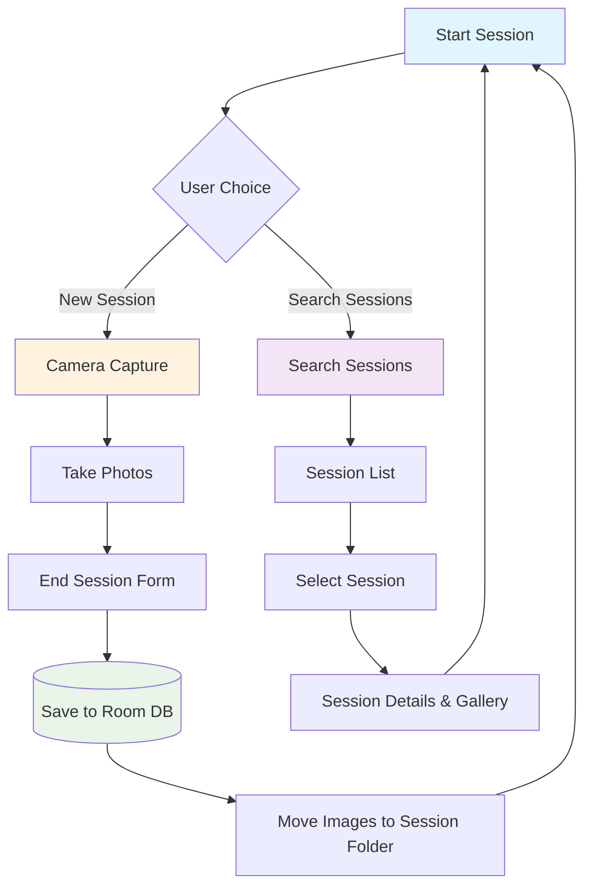

# Visident - Session-Based Camera App

<div align="center">


*A modern Android application demonstrating session-based image capture with metadata management using cutting-edge Android technologies.*

</div>

## Overview

Visident is a comprehensive Android application that showcases modern Android development practices by implementing a session-based camera application. Users can create photography sessions, capture multiple images per session, store metadata, and search through their sessions with a beautiful, intuitive UI.

## Features

### Core Functionality
- **Session-Based Image Capture**: Organize photos into distinct sessions
- **Real-time Camera Preview**: Live camera feed using CameraX Compose integration
- **Metadata Management**: Store session details (ID, name, age, timestamp, image count)
- **Image Gallery**: View captured images in an organized grid layout
- **Search & Filter**: Find sessions by name or session ID
- **Scoped Storage**: App-specific external storage following Android best practices

### User Experience
- **Modern Material 3 Design**: Beautiful, adaptive UI components
- **Dark/Light Theme Support**: System-aware theme switching
- **Custom Typography**: Google Fonts (Inter) integration
- **Responsive Layout**: Works seamlessly across different screen sizes
- **Intuitive Navigation**: Smooth transitions between screens

## Architecture & Tech Stack

### **UI Layer**
```
┌─────────────────────────────────────────────┐
│                Jetpack Compose              │
├─────────────────────────────────────────────┤
│ • Material 3 Components                     │
│ • Custom Theme & Typography                 │
│ • Compose Navigation (Type-Safe Routes)     │
│ • CameraX Compose Integration              │
│ • Coil for Image Loading                    │
│ • Google Fonts Integration                  │
└─────────────────────────────────────────────┘
```

### **Business Logic Layer**
```
┌─────────────────────────────────────────────┐
│               MVVM Pattern                  │
├─────────────────────────────────────────────┤
│ • HiltViewModel with Dependency Injection   │
│ • StateFlow for Reactive State Management   │
│ • Coroutines for Asynchronous Operations    │
│ • Repository Pattern for Data Access        │
└─────────────────────────────────────────────┘
```

### **Data Layer**
```
┌─────────────────────────────────────────────┐
│              Data Persistence              │
├─────────────────────────────────────────────┤
│ • Room Database (SQLite)                    │
│ • DAO Pattern for Database Operations       │
│ • Entity Classes with Annotations           │
│ • App-Specific External Storage             │
└─────────────────────────────────────────────┘
```

### **Infrastructure Layer**
```
┌─────────────────────────────────────────────┐
│          Dependency Injection              │
├─────────────────────────────────────────────┤
│ • Hilt for DI Container                     │
│ • Modules for Dependency Provision          │
│ • Scoped Components (Singleton, Activity)   │
│ • Compile-time Safety                       │
└─────────────────────────────────────────────┘
```

## Project Structure

```
app/src/main/java/dev/vaibhavp/visident/
├── MainActivity.kt                    # Entry point with Hilt & Compose setup
├── VisidentApplication.kt            # Application class with Hilt initialization
│
├── data/                             # Data layer components
│   ├── db/
│   │   ├── AppDB.kt                     # Room database definition
│   │   └── SessionDao.kt                # Data access object for sessions
│   └── model/
│       └── SessionEntity.kt             # Room entity for session metadata
│
├── di/                               # Dependency injection modules
│   ├── DatabaseModule.kt               # Provides database dependencies
│   └── RepositoryModule.kt             # Provides repository dependencies
│
├── repo/                            # Repository pattern implementation
│   └── SessionRepository.kt            # Data access abstraction layer
│
├── ui/                               # User interface components
│   ├── components/
│   │   └── SessionDetailsCard.kt       # Reusable session card component
│   ├── navigation/
│   │   ├── AppNavHost.kt               # Navigation host setup
│   │   └── AppNavigation.kt            # Type-safe navigation routes
│   ├── search/
│   │   └── SearchSessionScreen.kt      # Session search & filtering UI
│   ├── session/
│   │   ├── CameraCaptureScreen.kt      # Camera preview & capture UI
│   │   ├── EndSessionScreen.kt         # Session metadata input form
│   │   ├── SessionDetailScreen.kt      # Session details & image gallery
│   │   └── StartSessionScreen.kt       # App entry point screen
│   └── theme/
│       ├── Color.kt                    # Color palette definition
│       ├── Theme.kt                    # Material 3 theme configuration
│       └── Type.kt                     # Typography with Google Fonts
│
├── util/                            # Utility classes
│   ├── CameraUtility.kt               # CameraX helper functions
│   └── FileUtils.kt                   # File operations & storage management
│
└── viewmodel/                       # ViewModels for state management
    └── SessionViewModel.kt            # Main ViewModel with business logic
```

## Technologies Deep Dive

### **Android Architecture Components**

| Component | Version | Purpose |
|-----------|---------|---------|
| **Jetpack Compose** | `2025.08.01` | Modern declarative UI toolkit |
| **Material 3** | Latest | Design system with adaptive layouts |
| **Navigation Compose** | `2.9.3` | Type-safe navigation with serialization |
| **Room Database** | `2.7.2` | SQLite abstraction with compile-time verification |
| **Hilt** | `2.57.1` | Dependency injection framework |
| **CameraX** | `1.5.0-rc01` | Modern camera API with Compose integration |
| **Lifecycle** | `2.9.3` | Lifecycle-aware components |

### **Key Libraries**

```kotlin
// UI & Design
implementation("androidx.compose.material3:material3")
implementation("androidx.compose.ui:ui-text-google-fonts:1.9.0")
implementation("io.coil-kt:coil-compose:2.7.0")

// Camera & Permissions
implementation("androidx.camera:camera-compose:1.5.0-rc01")
implementation("com.google.accompanist:accompanist-permissions:0.37.3")

// Database & Storage
implementation("androidx.room:room-ktx:2.7.2")
kapt("androidx.room:room-compiler:2.7.2")

// Dependency Injection
implementation("com.google.dagger:hilt-android:2.57.1")
kapt("com.google.dagger:hilt-android-compiler:2.57.1")

// Navigation & State
implementation("androidx.navigation:navigation-compose:2.9.3")
implementation("org.jetbrains.kotlinx:kotlinx-serialization-core:1.9.0")

// Logging & Debug
implementation("com.jakewharton.timber:timber:5.0.1")
```

## Application Flow Diagram



## Database Schema

```sql
CREATE TABLE sessions (
    sessionId TEXT PRIMARY KEY NOT NULL,
    name TEXT NOT NULL,
    age INTEGER NOT NULL,
    createdAt INTEGER NOT NULL,
    imageCount INTEGER NOT NULL
);
```

### **Room Database Architecture**
```
SessionEntity.kt
├── @Entity(tableName = "sessions")
├── @PrimaryKey sessionId: String
├── name: String
├── age: Int
├── createdAt: Long (timestamp)
└── imageCount: Int

SessionDao.kt
├── @Insert(onConflict = REPLACE)
├── @Query("SELECT * FROM sessions WHERE sessionId = :id")
└── @Query("SELECT * FROM sessions ORDER BY createdAt DESC")

AppDB.kt
├── @Database(entities = [SessionEntity::class], version = 1)
├── abstract fun sessionDao(): SessionDao
└── RoomDatabase()
```

## File Storage Architecture

```
Device Storage
└── Android/media/dev.vaibhavp.visident/
    └── Sessions/
        ├── session_20250903_001/
        │   ├── IMG_20250903_143052.jpg
        │   ├── IMG_20250903_143105.jpg
        │   └── IMG_20250903_143118.jpg
        ├── session_20250903_002/
        │   ├── IMG_20250903_150221.jpg
        │   └── IMG_20250903_150234.jpg
        └── cache/
            └── temp_images/
```

### **Storage Benefits**
- **Scoped Storage Compliant**: No `WRITE_EXTERNAL_STORAGE` permission needed
- **App-Specific**: Files automatically cleaned up on app uninstall
- **Organized Structure**: Sessions grouped by unique identifiers
- **Cache Management**: Temporary files handled separately

## Getting Started

### Prerequisites
- **Android Studio**: Giraffe (2022.3.1) or newer
- **Minimum SDK**: 26 (Android 8.0)
- **Target SDK**: 36 (Android 15)
- **Java Version**: 11
- **Gradle**: 8.13

### Quick Setup

1. **Clone the repository**
   ```bash
   git clone https://github.com/vaibhavppandey/visident.git
   cd visident
   ```

2. **Open in Android Studio**
   - Import the project
   - Sync Gradle files
   - Build the project

3. **Run the application**
   ```bash
   ./gradlew assembleDebug
   # Or use Android Studio's run button
   ```

## Permissions

| Permission | Purpose | Request Method |
|------------|---------|----------------|
| `CAMERA` | Camera access for image capture | Runtime via Accompanist |
| ~~`WRITE_EXTERNAL_STORAGE`~~ | Not needed | App-specific storage used |

## Key Features Demonstrated

### **Architecture Patterns**
- **MVVM**: Clear separation of concerns
- **Repository Pattern**: Abstracted data access
- **Dependency Injection**: Hilt for compile-time safety
- **State Management**: Reactive UI with StateFlow
- **Clean Architecture**: Layered approach

### **Modern UI/UX**
- **Jetpack Compose**: 100% declarative UI
- **Material 3**: Latest design system
- **Type-Safe Navigation**: Kotlinx Serialization
- **Custom Typography**: Google Fonts integration
- **Responsive Design**: Adaptive layouts

### **Data Management**
- **Room Database**: Local data persistence
- **Coroutines**: Asynchronous operations
- **File Management**: Scoped storage implementation
- **Image Loading**: Coil integration

### **Modern Android Development**
- **CameraX Integration**: Modern camera API
- **Permission Handling**: Runtime permission requests
- **Edge-to-Edge**: Modern navigation experience
- **Testing Support**: Unit and instrumentation test setup

## Build & Deploy

### **Local Development**
```bash
# Debug build
./gradlew assembleDebug

# Release build
./gradlew assembleRelease

# Run tests
./gradlew test

# Clean build
./gradlew clean build
```

### **CI/CD Pipeline**
The project includes a custom GitHub Actions workflow for automated builds:

```yaml
# .github/workflows/publish-apk.yml
name: Build & Release APK
on:
  push:
    tags: ["*"]
  workflow_dispatch:

# Features:
# Java 11 setup matching project config
# Gradle caching for faster builds
# Automatic APK generation
# GitHub Releases with version info
# Professional release notes
```

### **Release Process**
1. **Tag a release**:
   ```bash
   git tag v1.0.1
   git push origin v1.0.1
   ```

2. **Automatic build**: GitHub Actions builds and creates release
3. **Download APK**: Available in GitHub Releases

## License

This project is licensed under the **MIT License** - see the [LICENSE](LICENSE) file for details.

```
MIT License

Copyright (c) 2025

Permission is hereby granted, free of charge, to any person obtaining a copy
of this software and associated documentation files (the "Software"), to deal
in the Software without restriction, including without limitation the rights
to use, copy, modify, merge, publish, distribute, sublicense, and/or sell
copies of the Software, and to permit persons to whom the Software is
furnished to do so, subject to the following conditions:

The above copyright notice and this permission notice shall be included in all
copies or substantial portions of the Software.

THE SOFTWARE IS PROVIDED "AS IS", WITHOUT WARRANTY OF ANY KIND, EXPRESS OR
IMPLIED, INCLUDING BUT NOT LIMITED TO THE WARRANTIES OF MERCHANTABILITY,
FITNESS FOR A PARTICULAR PURPOSE AND NONINFRINGEMENT. IN NO EVENT SHALL THE
AUTHORS OR COPYRIGHT HOLDERS BE LIABLE FOR ANY CLAIM, DAMAGES OR OTHER
LIABILITY, WHETHER IN AN ACTION OF CONTRACT, TORT OR OTHERWISE, ARISING FROM,
OUT OF OR IN CONNECTION WITH THE SOFTWARE OR THE USE OR OTHER DEALINGS IN THE
SOFTWARE.
```
---

<div align="center">

**Made with ❤ using Modern Android Development practices**

*Showcasing Jetpack Compose • Room Database • CameraX • Hilt DI • Material 3*

</div>
